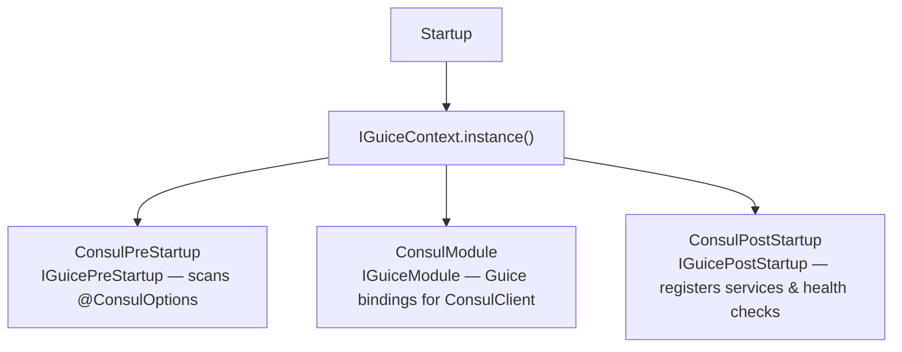
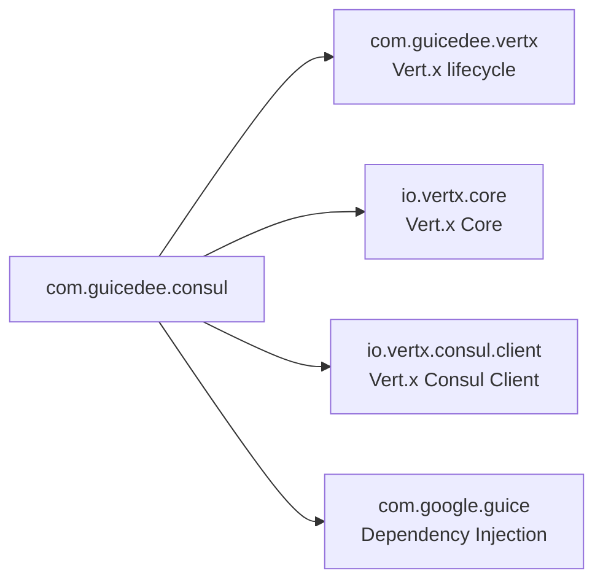

# GuicedEE Consul

[](https://github.com/GuicedEE/GuicedConsul/actions/workflows/build.yml)
[](https://github.com/GuicedEE/GuicedConsul)
[](https://www.apache.org/licenses/LICENSE-2.0)


Core **Consul integration for GuicedEE** using Vert.x Consul Client. Provides annotation-driven Consul client access, automatic service registration, health check wiring, and clean deregistration on shutdown.

Built on [Vert.x 5](https://vertx.io/) · [Vert.x Consul Client](https://vertx.io/docs/vertx-consul-client/java/) · [Google Guice](https://github.com/google/guice) · JPMS module `com.guicedee.consul` · Java 25+

## 📦 Installation

```xml
<dependency>
  <groupId>com.guicedee</groupId>
  <artifactId>consul</artifactId>
</dependency>
```

<details>
<summary>Gradle (Kotlin DSL)</summary>

```kotlin
implementation("com.guicedee:consul:2.1.0-SNAPSHOT")
```
</details>

## ✨ Features

- **Annotation-driven configuration** — `@ConsulOptions` on `package-info.java` configures the Consul client
- **Automatic service registration** — registers on startup, deregisters on shutdown
- **HTTP health checks** — attaches health check endpoints to registered services
- **Environment variable overrides** — all annotation attributes overridable without code changes
- **Named client injection** — multiple Consul clients via `@Named` qualifier
- **Guice-managed lifecycle** — startup/shutdown hooks via `IGuicePostStartup` / `IGuicePreDestroy`

## 🚀 Quick Start

**Step 1** — Configure Consul on your package:

```java
@ConsulOptions(
    value = "default",
    host = "localhost",
    port = 8500,
    registerService = true,
    serviceName = "wallet-api",
    servicePort = 8080,
    healthPath = "/health/ready",
    healthInterval = "10s",
    deregisterAfter = "1m"
)
package com.myapp.wallet;

import com.guicedee.consul.ConsulOptions;
```

**Step 2** — Inject and use the Consul client:

```java
@Inject
@Named("default")
ConsulClient consulClient;
```

That's it. The module discovers `@ConsulOptions`, creates the client, registers the service, and wires health checks automatically.

## 📐 Architecture



## ⚙️ Configuration

Place `@ConsulOptions` on `package-info.java`:

| Attribute | Default | Purpose |
|---|---|---|
| `value` | `"default"` | Named qualifier for injection |
| `host` | `"localhost"` | Consul agent host |
| `port` | `8500` | Consul agent port |
| `token` | `""` | ACL token |
| `registerService` | `true` | Whether to register the service |
| `serviceName` | `""` | Service name in Consul catalog |
| `servicePort` | `8080` | Port for the registered service |
| `healthPath` | `"/health/ready"` | HTTP health check path |
| `healthInterval` | `"10s"` | Health check interval |
| `deregisterAfter` | `"1m"` | Critical service deregister timeout |

## 🌍 Environment Variable Overrides

All annotation values are overridable:

| Pattern | Example |
|---|---|
| `CONSUL_{NORMALIZED_NAME}_{PROPERTY}` | `CONSUL_DEFAULT_HOST=consul.internal` |
| `CONSUL_{PROPERTY}` (global fallback) | `CONSUL_TOKEN=my-acl-token` |

## 🔗 Service Registration

When `registerService = true`, the module automatically:
1. Registers the service with Consul on startup
2. Attaches HTTP health checks at the configured path
3. Deregisters cleanly on JVM shutdown

## 🔍 Service Discovery

Combine with `com.guicedee:consul-service-resolver` to resolve services via Consul:

```java
@ServiceResolverOptions(value = "my-service", type = "consul")
package com.myapp.client;
```

Then use with `@Endpoint` and `RestClient` as normal.

## 🔌 SPI & Extension Points

| SPI | Purpose |
|---|---|
| `IGuicePreStartup` | Scans for `@ConsulOptions` annotations |
| `IGuicePostStartup` | Registers services and health checks |
| `IGuiceModule` | Binds `ConsulClient` instances to Guice |

## 🗺️ Module Graph



## 🧩 JPMS

Module name: **`com.guicedee.consul`**

The module:
- **exports** `com.guicedee.consul`
- **provides** `IGuicePreStartup` with `ConsulPreStartup`, `IGuicePostStartup` with `ConsulPostStartup`, `IGuiceModule` with `ConsulModule`

```java
module my.app {
    requires com.guicedee.consul;
}
```

## 🏗️ Key Classes

| Class | Role |
|---|---|
| `ConsulOptions` | Annotation for Consul connection and registration configuration |
| `WrappedConsulOptions` | Resolved options with environment variable overrides applied |
| `ConsulPreStartup` | Scans `@ConsulOptions` annotations at startup |
| `ConsulPostStartup` | Registers services and health checks with Consul |
| `ConsulModule` | Guice module binding `ConsulClient` instances |

## 🤝 Contributing

Issues and pull requests are welcome — please add tests for new features.

## 📄 License

[Apache 2.0](https://www.apache.org/licenses/LICENSE-2.0)
